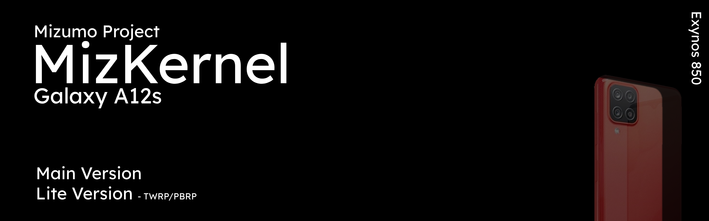
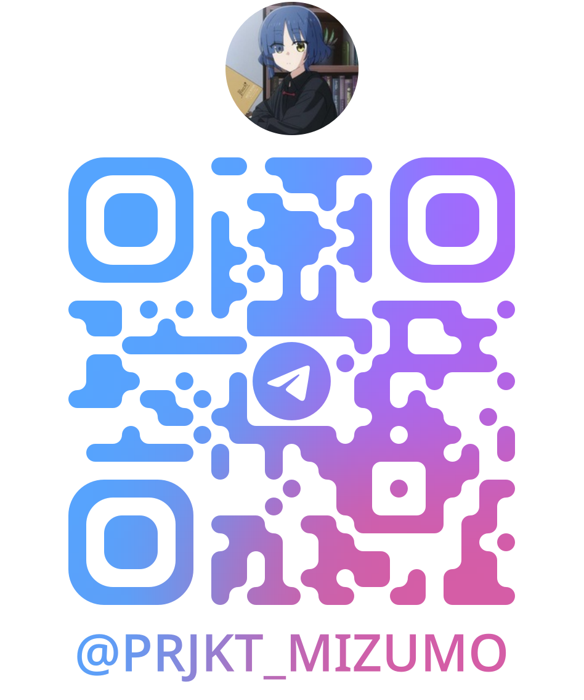

 <h1 style="margin: -3px 0 0">Mizumo Project</h1>
Android Kernel under Mizumo Project

Check : https://t.me/prjkt_mizumo for updates
 Or Scan this on your telegram:
  

 
 

Status:

| **Main Variants**                        | **Status** |
|-------------------------------------|------------|
| Kernel having KSU by @tiann         | FAIL       |
| Kernel having KSU-Legacy by @rsuntk | SUCCESS    |
| Normal Version                      | SUCCESS    |
| Lite Version : For Recovery Kernels | SUCCESS    |

